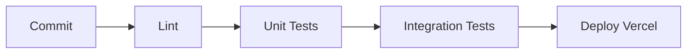

# Ideias de Melhorias

> [!quote] "O software nunca está pronto."  
> Lista organizada de próximos passos, organizada por prioridade e esforço.

---

## ✅ Últimas Implementações (24/05/2026)

### 🔁 Transações Recorrentes
- [x] Tabela `recorrentes`, service com CRUD + geração automática
- [x] Página `#/recorrentes` com toggle, deletar, botão "Gerar"
- [x] Opção "Repetir" no form do Dashboard com frequência, data fim e máx ocorrências
- [x] Atalho `Ctrl+R`, link no menu lateral
- [x] Geração automática ao carregar o dashboard

### 🦴 Skeleton nos Gráficos
- [x] Canvas dos charts recebem classe `skeleton skeleton-chart` no HTML
- [x] Classe removida automaticamente após Chart.js renderizar
- [x] Shimmer animado aparece no lugar do gráfico enquanto carrega

### 🔗 Filtros e Paginação na URL
- [x] Filtros (descricao, tipo, categoria, metodoPagamento, data) sincronizados com hash params
- [x] Paginação (page, pageSize) na URL — dá pra compartilhar link exato
- [x] `showDashboard()` lê estado dos params no início
- [x] `handleHashChange()` não remove mais os query params

### 🧪 Testes com Node --test (em vez de Vitest)
- [x] Tabela `recorrentes`, service com CRUD + geração automática
- [x] Página `#/recorrentes` com toggle, deletar, botão "Gerar"
- [x] Opção "Repetir" no form do Dashboard com frequência, data fim e máx ocorrências
- [x] Atalho `Ctrl+R`, link no menu lateral
- [x] Geração automática ao carregar o dashboard

### 🧪 Testes com Node --test (em vez de Vitest)
- [x] Frontend: `format.test.js` com `node:test` (resolveu erro `@vite/env`)
- [x] Backend: `financeiroService.test.js` com `node:test`
- [x] `parseCSV`/`parseOFX` exportadas do módulo

### 📧 Relatório por Email
- [x] `sendReport()` no emailService (gera .xlsx + anexa via SMTP)
- [x] `POST /api/exportar/email` — endpoint autenticado
- [x] Opção "Email (.xlsx)" no modal de exportação

### 🔔 Push Notification ao Gerar Recorrentes
- [x] `web-push` instalado e configurado
- [x] `sendToUser()` no notificationService
- [x] Hook em `gerarLancamentos()` notifica ao gerar

### 🧪 Testes E2E com Playwright
- [x] 7 testes: register, login, dashboard, create transaction, perfil, recorrentes, health
- [x] Script `tests/e2e_test.py` + `npm run test:e2e`

### 🎨 Página de Login com Personalidade
- [x] Blocos geométricos decorativos com `clip-path` nos cantos
- [x] Formas flutuantes animadas (triângulos + losangos) com `@keyframes floatShape`
- [x] Aplicado em login, register, forgot-password, reset-password, change-password

### 🐛 Bugfixes
- [x] `isSaida()` prioridade corrigida: texto `entradaSaida` primeiro, `valor < 0` fallback
- [x] `formatDate()` agora faz parse manual sem timezone (evita -1 dia no Brasil)

## ✅ Últimas Implementações (21/05/2026)

### Página de Perfil + Tema Sincronizado
- [x] ProfilePage.js com edição de nome, sobrenome, foto
- [x] Seletor de tema com sync ao backend
- [x] Atalho `Ctrl+P`, rota `#/perfil`, link na sidebar
- [x] `initTheme()` aceita tema do servidor

### Notificações Push
- [x] `POST /api/push/subscribe` — subscription persistida
- [x] `GET /api/push/vapid-public-key` — chave pública VAPID
- [x] SW listeners `push` + `notificationclick`
- [x] Toggle no perfil com slider + permissão

### Importação CSV Refatorada
- [x] Leitura da coluna `Tipo` do CSV (não deriva mais só do sinal do valor)
- [x] BOM UTF-8 removido automaticamente
- [x] `\r\n` / `\r` normalizados
- [x] Auto-detecte `;` ou `,`
- [x] Quotes em cabeçalhos e valores tratados
- [x] `metodoPagamento` e `observacoes` salvos na importação
- [x] Sinal do `valor` consistente: negativo para Saída, positivo para Entrada
- [x] Debug "Amostra dos dados" na resposta da importação

### Reforma do Sistema de Tipo
- [x] `isSaida()` prioriza texto `entradaSaida`, fallback ao sinal do valor
- [x] Backend deriva tipo do sinal do valor em `salvarLancamento`
- [x] Form submit envia valor com sinal correto (negativo p/ Saída)
- [x] Export CSV/JSON usa `getTipo(l)` em vez de `l.entradaSaida`

### Dashboard Avançado
- [x] Gráfico de evolução mensal (receitas vs despesas) — linha
- [x] Gráfico de categorias (pizza/donut interativo)
- [x] Comparativo mensal (mês atual × mês anterior)
- [x] Meta de economia mensal com progresso visual
- [x] Projeção de saldo futuro

### Exportação Avançada
- [x] Exportar por período selecionável
- [x] Exportar com filtros aplicados
- [x] Relatório PDF com gráficos embutidos
- [ ] Envio por email do relatório

### Temas Melhorados
- [x] Temas pré-definidos (Dark, Dracula, Nord, Claro)
- [x] Transição suave entre temas
- [x] Seletor de tema no sidebar
- [x] Tema claro refinado: paleta warm monochrome (off-white #EBE9E4, charcoal #2F3437, bordas #DCD8D0, pastéis dessaturados)
- [x] 3 novos temas: Tokyo Night, Gruvbox, Rose Pine
- [ ] Salvar preferência no backend

### Novas Features (20/05/2026)
- [x] Filtro por categoria + método de pagamento no dashboard
- [x] Ordenação por colunas (clicar nos headers)
- [x] Paginação com seletor de itens por página
- [x] Checkbox de seleção + deletar em massa
- [x] Duplicar transação (botão copy)
- [x] Observações personalizadas no form
- [x] Método de pagamento no form
- [x] Exportar JSON
- [x] Página de alterar senha (logado)
- [x] Atalhos de teclado: Ctrl+N, Ctrl+S, Ctrl+F, Esc

---

## 🎨 Melhorias de Design

### 1. 🖋️ Tipografia Distintiva
- [x] Substituir fonte do sistema por par tipográfico (DM Serif Display p/ títulos + Outfit p/ corpo)
- [x] Adicionar `<link>` das fontes no `index.html`
- [x] Definir `font-family` nas variáveis CSS

### 2. 📊 Cards de Estatística com Personalidade
- [x] Gradiente diagonal no ícone com fundo circular
- [x] `font-variant-numeric: tabular-nums` + tracking mais solto nos números
- [ ] Sinal de + ou - animado quando o valor muda (CSS `@keyframes`)
- [x] Hover com elevation: `box-shadow` + `translateY(-2px)` + transição suave

### 3. 📋 Tabela com Linhas-Card
- [x] Cada linha com `border-radius` sutil + `box-shadow` leve
- [x] Hover com destaque na borda esquerda (verde p/ entrada, vermelho p/ saída)
- [x] `transition` suave em todos os estados

### 4. 🎨 Página de Login com Personalidade ✅

- [x] Bloco decorativo geométrico no canto (triângulos/círculos com `clip-path`)
- [x] Formas flutuantes animadas (triângulos + losangos) com `@keyframes floatShape`
- [x] Aplicado em login, register, forgot-password, reset-password e change-password

### 5. 🌀 Transições entre Páginas
- [x] `@keyframes pageFadeIn` com `translateY(12px)` no conteúdo ao navegar
- [ ] `animation-delay` escalonado nos elementos internos (staggered reveal)
- [ ] Transição suave de saída antes de trocar a rota

### 6. 🎯 Badges de Tipo com mais Presença
- [x] Fundo gradiente sutil nos badges "Entrada"/"Saída"
- [x] `::before` com bolinha colorida indicando o tipo
- [x] Letter-spacing maior, uppercase obrigatório

### 7. 🧩 Empty States Ilustrados ✅
- [x] 3 SVGs decorativos: chart (dashboard vazio), search (filtro sem resultado), list (recorrentes vazia)
- [x] Título com `font-heading` + subtítulo explicativo
- [x] Dashboard vazio mostra ilustração + CTA "Nova Transação"
- [x] Compartilhado via `emptyStateSVG(type)` e `renderEmptyState()` em `dom.js`

---

## ⚡ Performance & Infraestrutura

### 1. 📦 Otimizar Bundle do Chart.js
- [x] Substituir `import Chart from 'chart.js/auto'` por import seletivo (~240KB → ~90KB)
- [x] Importar só: `LineController, LineElement, PointElement, BarController, BarElement, CategoryScale, LinearScale, DoughnutController, PieController, ArcElement, Tooltip, Legend, Filler`
- [x] Shared `chartSetup.js` com `Chart.register()`

```
chart.js/auto importa TODOS os componentes
Só usamos: line + doughnut/pie/bar
Economia estimada: ~150KB no bundle final
```

### 2. ⚡ `vite-plugin-pwa` (substituir SW manual)
- [ ] Instalar `vite-plugin-pwa -D`
- [ ] Configurar no `vite.config.js` com `registerType: 'autoUpdate'`
- [ ] Gerar Service Worker com Workbox em vez do `sw.js` manual em `public/`
- [ ] Habilitar `devOptions.enabled` para testar em dev
- [ ] Manter notificações push (custom SW)
- [ ] Auto-inject do manifest + caching de assets estáticos

### 3. 🚀 Migrar Express 4 → Express 5
- [ ] Atualizar `express` no `backend/package.json` para `^5.2.0`
- [ ] Verificar breaking changes: `res.redirect()` sem magic string `'back'`
- [ ] Query parser agora usa modo `'simple'` por padrão
- [ ] `res.clearCookie()` ignora `maxAge`/`expires` do usuário
- [ ] MIME types: `application/javascript` → `text/javascript`
- [ ] `res.status()` só aceita inteiros 100-999

### 4. 🔍 Análise de Bundle
- [ ] Adicionar `vite-plugin-visualizer` para debug visual do bundle
- [ ] Rodar `npx vite-bundle-analyzer` no build
- [ ] Identificar dependências pesadas não utilizadas

### 5. 🌀 Page Transitions em Todas as Páginas
- [x] Aplicar classe `.page-enter` nas pages: Login, Profile, Extrato, ForgotPassword, ResetPassword, Register, ChangePassword
- [ ] Adicionar `animation-delay` escalonado (staggered reveal) em listas e grids
- [ ] Transição de saída (fade-out) antes de trocar rota

### 6. 🦴 Skeleton Screens em vez de Spinner
- [x] Classe CSS `.skeleton` com shimmer animado (`@keyframes shimmer`)
- [x] `showDashboardSkeleton()` com placeholders para stats, charts e tabela
- [x] Dashboard usa skeleton em vez de `showSpinner('Carregando…')`
- [x] Skeleton nos gráficos (placeholder com shimmer nos canvases)

---

## 🔥 Prioridade Alta

### 1. 🧪 Testes Automatizados

- [x] Testes E2E com Playwright (login → dashboard → criar → páginas)
- [ ] Testes unitários para `authService` e `financeiroService`
- [ ] Testes de integração para endpoints críticos (login, salvar, listar)
- [ ] Testes E2E com Playwright ou Cypress
- [ ] CI/CD no GitHub Actions



### 2. 🔒 Autenticação de Dois Fatores (2FA)

- [ ] Adicionar tabela `user_2fa` no banco
- [ ] Gerar secret TOTP na ativação
- [ ] Tela de verificação de código no login
- [ ] Códigos de recuperação (backup codes)

> [!tip] Lib sugerida: `otplib` ou `speakeasy`

### 3. 🔁 Transações Recorrentes ✅

- [x] Tabela `recorrentes` criada com suporte a frequências (semanal, quinzenal, mensal, anual)
- [x] Geração automática ao carregar o dashboard (hook em `listarLancamentos`)
- [x] Geração manual via botão na página `#/recorrentes`
- [x] Página dedicada com toggle ativo/inativo, exclusão e feedback
- [x] Opção "Repetir" no formulário de nova transação
- [x] Suporte a data fim e número máximo de ocorrências (parcelas)
- [ ] Notificar antes do vencimento (push notification)

---

## 📋 Prioridade Média

### 4. 🔔 Notificações Push

- [x] Endpoint `POST /api/push/subscribe` para salvar subscription
- [x] Envio de notificação push ao gerar lançamentos recorrentes
- [ ] Envio de alertas automáticos (ex: "Você gastou 80% do orçamento")
- [x] Botão "Ativar notificações" no perfil
- [x] Tratar permissão negada / revogada

### 5. 📤 Melhorias na Exportação

- [x] Envio por email do relatório (.xlsx anexado)
- [x] Exportar para Excel (.xlsx)
- [ ] Tema claro no PDF

### 6. 🌙 Tema — Salvar no Backend

- [x] Endpoint `PUT /api/profile/theme`
- [x] Sincronizar tema entre dispositivos
- [ ] Temas customizáveis pelo usuário

---

## 📋 Prioridade Média

### 7. 🤖 Assistente Financeiro com IA

> [!idea] Chat/consultas em linguagem natural sobre finanças pessoais

- [ ] Chat integrado no dashboard para perguntas como "Quanto gastei em alimentação esse mês?" ou "Qual foi meu maior gasto?"
- [ ] Análise de gastos com sugestões de economia personalizadas
- [ ] Detecção de padrões — "Você gastou 30% a mais em delivery esse mês"
- [ ] Classificação inteligente de transações não categorizadas
- [ ] Previsão de saldo futuro baseada em histórico + recorrentes
- [ ] Sugestão de meta de economia realista baseada nos gastos

> [!tip] Possíveis abordagens
> - **Leve**: Regras heurísticas + templates no backend, sem API externa
> - **Médio**: Integração com API GPT (OpenAI/Claude) via endpoint separado
> - **Completo**: Embeddings + RAG sobre os dados do usuário para consultas contextuais

---

## 💡 Prioridade Baixa

### 8. 👨‍👩‍👧‍👦 Compartilhamento / Multiusuário

- [ ] Conta familiar com múltiplos perfis
- [ ] Categorias e orçamentos compartilhados
- [ ] Permissões (admin, editor, visualizador)

### 9. 🏦 Integração Bancária

- [ ] Conectar com Open Finance do Brasil
- [ ] Sincronização automática de transações
- [ ] Classificação inteligente por machine learning

> [!warning] Esforço alto
> Open Finance exige certificação e registro no Banco Central.

### 10. 📱 App Mobile Nativo

- [ ] React Native ou Flutter
- [ ] Biometria (Touch ID / Face ID)
- [ ] Widgets de saldo rápido
- [ ] Suporte offline completo com SQLite local

---

## 🐛 Bugs Conhecidos

- [ ] ~~CORS preflight bloqueado em produção~~ ✅ Fix: middleware manual com OPTIONS handler
- [ ] ~~`ERR_ERL_UNEXPECTED_X_FORWARDED_FOR`~~ ✅ Fix: `app.set('trust proxy', 1)`
- [ ] ~~`/api/health` retornando "database: not configured"~~ ✅ Fix: DATABASE_URL não estava setada
- [ ] ~~CSS 404 no extrato (Linux case-sensitive)~~ ✅ Fix: renomeado para Extrato.css
- [ ] ~~`API_BASE_URL` redeclarada em register.js~~ ✅ Fix: função `getApiBaseUrl()`
- [ ] ~~Recursão infinita em `forgotPassword`~~ ✅ Fix: require de authService
- [ ] ~~Import CSV ignorava coluna Tipo (tudo virava "Entrada")~~ ✅ Fix: `parseCSV` lê `row.tipo`
- [ ] ~~Import CSV ignorava acento (Descrição virava "Transação")~~ ✅ Fix: `row['descrição']` adicionado
- [ ] ~~Import CSV quebrava com `\r\n` (Windows)~~ ✅ Fix: normalização de line endings
- [ ] ~~Import CSV quebrava com BOM (Excel)~~ ✅ Fix: `replace(/^\uFEFF/, '')`
- [ ] ~~Tipo inconsistente (form vs import vs display)~~ ✅ Fix: reforma completa do sistema de tipo

---

## 📈 Métricas de Qualidade

```yaml
Alvo:
  Cobertura de testes: > 80%
  Performance (API): < 200ms p95
  Lighthouse (mobile): > 85 em todas as categorias
  Acessibilidade: WCAG 2.1 AA
```

---

## Notas Relacionadas

- [[Gestor Financeiro]]
- [[API Documentation]]
- [[Service Worker Notes]]
- [[Readme do Projeto]]
- [[README Gap Analysis]]


---
