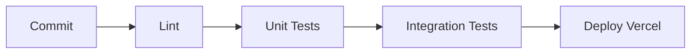

# Ideias de Melhorias

> [!quote] "O software nunca está pronto."  
> Lista organizada de próximos passos, organizada por prioridade e esforço.

---

## 🔥 Prioridade Alta

### 1. 🧪 Testes Automatizados

- [ ] Testes unitários para `authService` e `financeiroService`
- [ ] Testes de integração para endpoints críticos (login, salvar, listar)
- [ ] Testes E2E com Playwright ou Cypress
- [ ] CI/CD no GitHub Actions



### 2. 🔒 Autenticação de Dois Fatores (2FA)

- [ ] Adicionar tabela `user_2fa` no banco
- [ ] Gerar secret TOTP na ativação
- [ ] Tela de verificação de código no login
- [ ] Códigos de recuperação (backup codes)

> [!tip] Lib sugerida: `otplib` ou `speakeasy`

### 3. 📊 Dashboard Avançado

- [ ] Gráfico de evolução mensal (receitas vs despesas)
- [ ] Gráfico de categorias (pizza/donut interativo)
- [ ] Comparativo mensal (mês atual × mês anterior)
- [ ] Meta de economia mensal com progresso visual
- [ ] Projeção de saldo futuro

---

## 📋 Prioridade Média

### 4. 🔁 Transações Recorrentes

- [ ] Criar tabela `recorrentes` (user_id, descricao, valor, tipo, frequencia, proxima_data)
- [ ] Gerar lançamentos automaticamente no login ou via cron
- [ ] Suportar: semanal, quinzenal, mensal, anual
- [ ] Notificar antes do vencimento

```sql
CREATE TABLE recorrentes (
  id SERIAL PRIMARY KEY,
  user_id INTEGER REFERENCES usuarios(id) ON DELETE CASCADE,
  descricao TEXT NOT NULL,
  valor NUMERIC NOT NULL,
  entradaSaida TEXT NOT NULL,
  categoria TEXT DEFAULT 'Outros',
  frequencia TEXT NOT NULL, -- 'semanal', 'quinzenal', 'mensal', 'anual'
  dia_vencimento INTEGER,
  proxima_data DATE NOT NULL,
  ativo BOOLEAN DEFAULT TRUE,
  created_at TIMESTAMP DEFAULT CURRENT_TIMESTAMP
);
```

### 5. 🔔 Notificações Push (completar)

- [ ] Endpoint `POST /api/push/subscribe` para salvar subscription
- [ ] Envio de alertas (ex: "Você gastou 80% do orçamento de Alimentação")
- [ ] Botão "Ativar notificações" no dashboard
- [ ] Tratar permissão negada / revogada

### 6. 📤 Exportação Avançada

- [ ] Exportar por período selecionável
- [ ] Exportar com filtros aplicados
- [ ] Relatório PDF com gráficos embutidos
- [ ] Envio por email do relatório

---

## 💡 Prioridade Baixa

### 7. 👨‍👩‍👧‍👦 Compartilhamento / Multiusuário

- [ ] Conta familiar com múltiplos perfis
- [ ] Categorias e orçamentos compartilhados
- [ ] Permissões (admin, editor, visualizador)

### 8. 🏦 Integração Bancária

- [ ] Conectar com Open Finance do Brasil
- [ ] Sincronização automática de transações
- [ ] Classificação inteligente por machine learning

> [!warning] Esforço alto
> Open Finance exige certificação e registro no Banco Central.

### 9. 🌙 Tema Escuro Melhorado

- [ ] Paleta de cores customizável
- [ ] Temas pré-definidos (Dark, Dracula, Nord, etc.)
- [ ] Transição suave entre temas
- [ ] Salvar preferência no backend

### 10. 📱 App Mobile Nativo

- [ ] React Native ou Flutter
- [ ] Biometria (Touch ID / Face ID)
- [ ] Widgets de saldo rápido
- [ ] Suporte offline completo com SQLite local

---

## 🐛 Bugs Conhecidos

- [ ] ~~CORS preflight bloqueado em produção~~ ✅ Fix: middleware manual com OPTIONS handler
- [ ] ~~`ERR_ERL_UNEXPECTED_X_FORWARDED_FOR`~~ ✅ Fix: `app.set('trust proxy', 1)`
- [ ] ~~`/api/health` retornando "database: not configured"~~ ✅ Fix: DATABASE_URL não estava setada
- [ ] ~~CSS 404 no extrato (Linux case-sensitive)~~ ✅ Fix: renomeado para Extrato.css
- [ ] ~~`API_BASE_URL` redeclarada em register.js~~ ✅ Fix: função `getApiBaseUrl()`
- [ ] ~~Recursão infinita em `forgotPassword`~~ ✅ Fix: require de authService

---

## 📈 Métricas de Qualidade

```yaml
Alvo:
  Cobertura de testes: > 80%
  Performance (API): < 200ms p95
  Lighthouse (mobile): > 85 em todas as categorias
  Acessibilidade: WCAG 2.1 AA
```

---

## Notas Relacionadas

- [[Gestor Financeiro]]
- [[API Documentation]]
- [[Service Worker Notes]]
- [[Readme do Projeto]]
