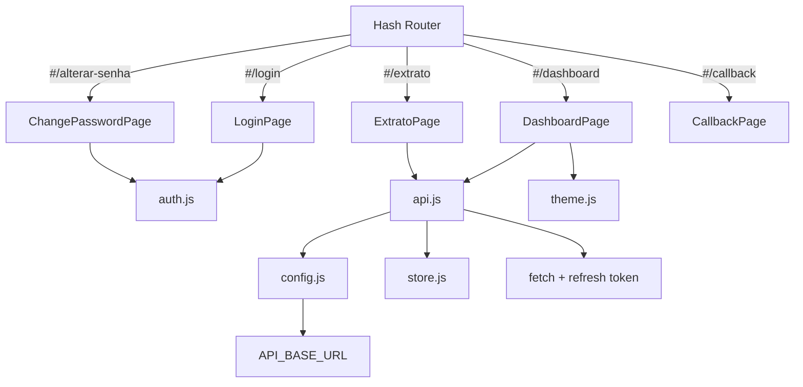

# Refatoração Frontend V2

## Motivação

A estrutura anterior do Frontend estava causando bugs críticos:
- `API_BASE_URL` retornava string vazia em produção
- Código deployado no Vercel estava **sempre desatualizado**
- Duplicação de arquivos (`extrato.html` na raiz E em `extrato/`)
- `index.js` com ~2090 linhas (monolito)
- Lógica de API/Token/Config espalhada por múltiplos arquivos

## Mudanças Principais

| Aspecto | Antes | Depois |
|---------|-------|--------|
| Bundler | Nenhum (CDNs) | **Vite 6** |
| Arquitetura | Multi-page HTML | **SPA** com hash routing |
| API URL | `getApiBaseUrl()` duplicado em N arquivos | **Único** `src/config.js` com `import.meta.env.DEV` |
| Dashboard | `index.js` (~2090 linhas) | `DashboardPage.js` (~1131 linhas) |
| Extrato | `extrato.js` (root) + `extrato/extrato.js` (subdir) | **Único** `ExtratoPage.js` |
| Login | `login.html` + `login.js` + `register.js` + `callback.html` | Componentes em `src/pages/` |
| Estilos | 7 CSSs espalhados | 5 CSSs organizados em `src/styles/` |
| Fetch | Manual com retry duplicado | Centralizado em `src/api.js` (retry + refresh automático) |
| Estado | `localStorage` direto | `src/store.js` reativo |
| Temas | Fixo (só dark) | 4 temas via `src/theme.js` |

## Estrutura Nova

```
front-end/
├── index.html              # Entry point SPA (único HTML)
├── package.json            # Vite + Chart.js + Toastify
├── vite.config.js
├── vercel.json
├── public/
│   ├── sw.js               # Service Worker v3
│   └── manifest.json
├── src/
│   ├── main.js             # App init + router + lazy loading
│   ├── config.js           # API_BASE_URL (centralizado)
│   ├── api.js              # Fetch + retry + refresh automático
│   ├── auth.js             # Login, register, social, reset, change-password
│   ├── store.js            # Estado reativo (token)
│   ├── router.js           # Hash-based SPA router
│   ├── pages/
│   │   ├── LoginPage.js
│   │   ├── RegisterPage.js
│   │   ├── DashboardPage.js
│   │   ├── ExtratoPage.js
│   │   ├── CallbackPage.js
│   │   ├── ForgotPasswordPage.js
│   │   ├── ResetPasswordPage.js
│   │   └── ChangePasswordPage.js
│   ├── theme.js         # 4 temas + apply + localStorage
│   ├── utils/
│   │   ├── dom.js           # Toast, Spinner
│   │   └── format.js        # Data, Moeda, Tipo (isSaida, getTipo)
│   ── styles/
│       ├── variables.css    # 4 temas completos (dark, dracula, nord, light)
│       ├── global.css       # Transição suave entre temas
│       ├── login.css
│       ├── dashboard.css    # + sort, pagination, checkbox, textarea
│       └── extrato.css
└── imgs/                    # Ícones (mantido)
```

> [!info] Por que Vite?
> Vite é **apenas um bundler**, não um framework. Continua usando Vanilla JS puro, mas ganha:
> - `import.meta.env.DEV` para detectar ambiente
> - Hot Module Replacement em dev
> - Tree-shaking e minificação em produção
> - Gerenciamento de dependências via npm (sem CDN)

## Fluxo de Dados



## API_BASE_URL (solução do bug)

Em `src/config.js`:
- **Dev**: usa `VITE_API_URL` env var ou `http://localhost:3000`
- **Production**: sempre retorna `https://projeto-financeiro-vert.vercel.app`

Não há mais chance de retornar string vazia — o código antigo não tinha fallback.

## Bugs Corrigidos

| Bug | Solução |
|-----|---------|
| `sobrenome: ''` falhava no cadastro | RegisterPage agora tem campo sobrenome |
| Reset senha incompatível | Frontend agora envia `{email, code, senha}` |
| Importar arquivo não funcionava | Usa `/api/importar/auto` com JSON |
| OAuth redirect 404 | Backend redireciona pra `/#/callback` |
| Profile update POST→PUT | Corrigido para `apiPut` |
| `pageTitle` null crash | Adicionada verificação `if (pageTitle)` |
| Categorias duplicadas | Usa `CATEGORIAS` de `config.js` |
| `@vite/client` 404 | Servidor Vite reiniciado corretamente |
| Código morto removido | `setState/getState/onState`, `showExtrato()`, `showToast` import |

## Próximos Passos

- [x] Criar estrutura Vite + SPA
- [x] Migrar Login, Dashboard, Extrato
- [x] Centralizar API/Config/Auth
- [x] Corrigir bugs críticos (cadastro, reset, import, OAuth)
- [x] Limpar código morto
- [x] Deploy no Vercel
- [x] Testar fluxo completo em produção
- [x] Adicionar página de alterar senha
- [x] Sistema de temas (4 temas + theme switcher)
- [x] Gráficos no dashboard (Chart.js)
- [x] Export CSV/JSON/PDF
- [x] Ordenação por coluna + paginação
- [x] Seleção em lote + exclusão em massa
- [x] Duplicar transação
- [x] Observações personalizadas + método de pagamento
- [x] Atalhos de teclado
- [x] Limpar arquivos antigos: `js/`, `css/`, `login/`, `extrato/`, `extrato.html`, `extrato.js`, `sw.js`, `manifest.json`, `imgs/img/`
