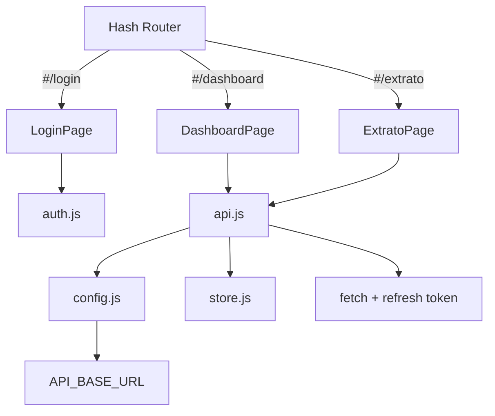

# Refatoração Frontend V2

## Motivação

A estrutura anterior do frontend estava causando bugs críticos:
- `API_BASE_URL` retornava string vazia em produção, fazendo requisições baterem no domínio errado (`/api/listar` 404)
- Código deployado no Vercel estava **sempre desatualizado** em relação ao código local (prova: line numbers não batiam)
- Duplicação de arquivos (`extrato.html` na raiz E em `extrato/`)
- `index.js` com ~2090 linhas (monolito difícil de manter)
- Lógica de API/Token/Config espalhada por múltiplos arquivos

## Mudanças Principais

| Aspecto | Antes | Depois |
|---------|-------|--------|
| Bundler | Nenhum (CDNs) | **Vite 6** |
| Arquitetura | Multi-page HTML | **SPA** com hash routing |
| API URL | `getApiBaseUrl()` duplicado em N arquivos | **Único** `src/config.js` com `import.meta.env.DEV` |
| Dashboard | `index.js` (~2090 linhas) | `DashboardPage.js` (~470 linhas) |
| Extrato | `extrato.js` (root) + `extrato/extrato.js` (subdir) | **Único** `ExtratoPage.js` |
| Login | `login.html` + `login.js` + `register.js` + `callback.html` | Componentes em `src/pages/` |
| Estilos | 7 CSSs espalhados | 5 CSSs organizados em `src/styles/` |
| Fetch | Manual com retry duplicado | Centralizado em `src/api.js` (retry + refresh automático) |
| Estado | `localStorage` direto | `src/store.js` reativo |

## Estrutura Nova

```
front-end/
├── index.html              # Entry point SPA (único HTML)
├── package.json            # Vite + Chart.js + Toastify
├── vite.config.js
├── vercel.json
├── public/
│   ├── sw.js               # Service Worker v3
│   └── manifest.json
├── src/
│   ├── main.js             # App init + router + lazy loading
│   ├── config.js           # API_BASE_URL (centralizado)
│   ├── api.js              # fetchWithRetry + refresh automático
│   ├── auth.js             # Login/register/social/reset
│   ├── store.js            # Estado reativo simples
│   ├── router.js           # Hash-based SPA router
│   ├── pages/
│   │   ├── LoginPage.js
│   │   ├── RegisterPage.js
│   │   ├── DashboardPage.js
│   │   ├── ExtratoPage.js
│   │   ├── CallbackPage.js
│   │   ├── ForgotPasswordPage.js
│   │   └── ResetPasswordPage.js
│   ├── utils/
│   │   ├── dom.js           # Toast, Spinner
│   │   └── format.js        # Data, Moeda, Tipo
│   └── styles/
│       ├── variables.css
│       ├── global.css
│       ├── login.css
│       ├── dashboard.css
│       └── extrato.css
└── imgs/                    # Ícones (mantido)
```

> [!info] Por que Vite?
> Vite é **apenas um bundler**, não um framework. Continua usando Vanilla JS puro, mas ganha:
> - `import.meta.env.DEV` para detectar ambiente
> - Hot Module Replacement em dev
> - Tree-shaking e minificação em produção
> - Gerenciamento de dependências via npm (sem CDN)

## Fluxo de Dados



## API_BASE_URL (solução do bug)

Em `src/config.js`:
- **Dev**: usa `VITE_API_URL` env var ou `http://localhost:3000`
- **Production**: sempre retorna `https://projeto-financeiro-vert.vercel.app`

Não há mais chance de retornar string vazia — o código antigo não tinha fallback.

## Próximos Passos

- [x] Criar estrutura Vite + SPA
- [x] Migrar Login, Dashboard, Extrato
- [x] Centralizar API/Config/Auth
- [x] Rodar `npm install && npm run build`
- [x] Deploy no Vercel
- [ ] Remover arquivos antigos (`login/`, `extrato/`, `js/`, `css/`)
- [ ] Testar fluxo completo em produção
