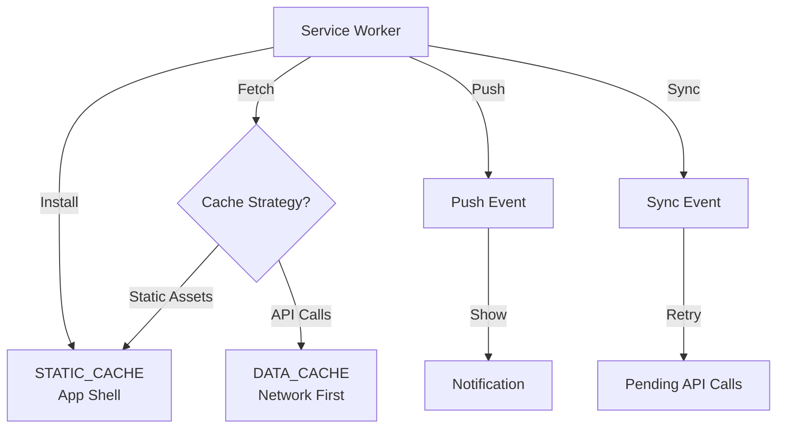
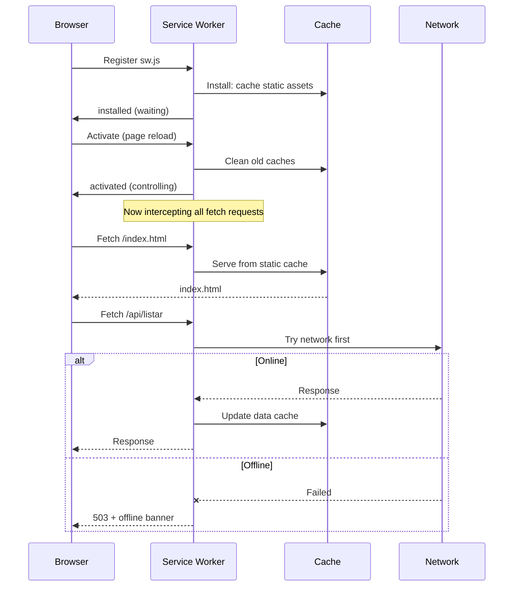
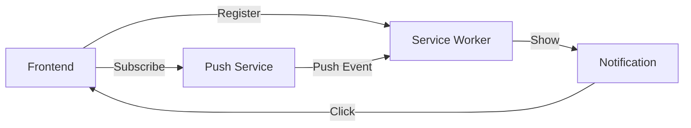
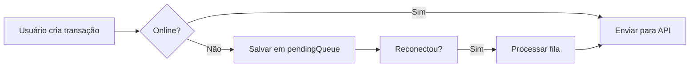

# Service Worker Notes

> Documentação da arquitetura PWA do Gestor Financeiro.  
> Arquivo: `front-end/public/sw.js` (v3 — refatorado com Vite)

---

## Visão Geral



---

## Cache Strategies

### STATIC_CACHE (Cache-First)

Usado para assets estáticos — HTML, CSS, JS, imagens, fontes.

```javascript
const STATIC_CACHE = 'static-v2';
const STATIC_ASSETS = [
  '/',
  '/index.html',
  '/css/modern.css',
  '/js/main.js',
  '/js/config.js',
  // ...
];
```

| Evento | Ação |
|--------|------|
| `install` | Pré-cacheia todos os `STATIC_ASSETS` |
| `activate` | Limpa caches antigos (versão anterior) |
| `fetch` | Cache-first: serve do cache, busca em paralelo |

> [!tip] Cache-First
> Garante que o app carregue instantaneamente mesmo offline, pois os assets já estão em cache.

### DATA_CACHE (Network-First)

Usado para chamadas de API (`/api/listar`, `/api/profile`, etc.).

| Situação | Comportamento |
|----------|---------------|
| ✅ Online | Busca da rede → atualiza cache → retorna resposta |
| ❌ Offline | Tenta rede → falha → retorna 503 (não usa cache stale) |

> [!warning] Sem stale cache para dados financeiros
> Optamos por não servir dados desatualizados quando offline para evitar que o usuário tome decisões com base em info incorreta.  
> Em vez disso, mostramos um banner "Offline — dados podem estar desatualizados".

---

## Service Worker Lifecycle



---

## Notificações Push

### Arquitetura



### Código (Frontend)

No [[Gestor Financeiro#📱 PWA Offline|NotificatioManager]]:

```javascript
// Registrar service worker
const reg = await navigator.serviceWorker.register('/sw.js');

// Inscrever para push
const sub = await reg.pushManager.subscribe({
  userVisibleOnly: true,
  applicationServerKey: urlBase64ToUint8Array(VAPID_PUBLIC_KEY)
});

// Salvar subscription no backend
await fetch('/api/push/subscribe', {
  method: 'POST',
  headers: { 'Authorization': `Bearer ${token}` },
  body: JSON.stringify(sub.toJSON())
});
```

### Service Worker (Push Handler)

```javascript
self.addEventListener('push', (event) => {
  const data = event.data?.json() || {
    title: 'Gestor Financeiro',
    body: 'Você tem novas movimentações!'
  };
  
  event.waitUntil(
    self.registration.showNotification(data.title, {
      body: data.body,
      icon: '/icon-192.png',
      badge: '/badge.png',
      actions: [
        { action: 'open', title: 'Abrir' },
        { action: 'close', title: 'Fechar' }
      ]
    })
  );
});

self.addEventListener('notificationclick', (event) => {
  event.notification.close();
  if (event.action === 'open') {
    clients.openWindow('/');
  }
});
```

---

## Modo Offline

### Indicador Visual

```html
<!-- Banner offline no index.html -->
<div id="offline-banner" class="offline-banner" style="display:none">
  <i class="fas fa-wifi-slash"></i> Modo offline — as alterações serão sincronizadas quando reconectar.
</div>
```

```javascript
// offlineManager no notifications.js
window.addEventListener('online', () => {
  document.getElementById('offline-banner').style.display = 'none';
  syncPendingTransactions();
});

window.addEventListener('offline', () => {
  document.getElementById('offline-banner').style.display = 'flex';
});
```

### Sincronização

| Operação | Comportamento Offline |
|----------|----------------------|
| Criar lançamento | Salva em fila local (`localStorage`) |
| Editar lançamento | Salva em fila local |
| Deletar lançamento | Salva em fila local |
| Listar | Mostra banner offline + dados do cache |
| Login/Registro | Bloqueado (requer rede) |



---

## VAPID Keys (Push)

Para gerar as chaves VAPID:

```bash
npx web-push generate-vapid-keys
```

```
Public Key: BEl...w==
Private Key: CQW...w==
```

> [!warning] As chaves VAPID devem ser adicionadas como env vars no Vercel:
> - `VAPID_PUBLIC_KEY`
> - `VAPID_PRIVATE_KEY`
> - `VAPID_SUBJECT` (mailto: seu@email.com)

---

## Performance

| Métrica | Valor | Nota |
|---------|:-----:|------|
| Tamanho do sw.js | ~2KB | Minificado |
| Static Cache Size | ~150KB | App shell completo |
| Estratégia API | Network-First | Prioriza dados atuais |
| Instalação PWA | ~3s (3G) | App shell leve |

---

## Checklist PWA

- [x] `manifest.json` com nome, ícones e theme_color
- [x] Service Worker registrado e ativo
- [x] Cache de assets estáticos (cache-first)
- [x] Fallback offline com banner
- [x] Push notifications configuradas
- [x] Ícone 192×192 e 512×512
- [x] Meta tags `mobile-web-app-capable`
- [x] Estratégia de atualização (activate → limpar caches antigos)

%%==================================================================================%%

## Notas Relacionadas

- [[Gestor Financeiro]]
- [[API Documentation]]
- [[Readme do Projeto]]
- [[Ideias de Melhorias]]
