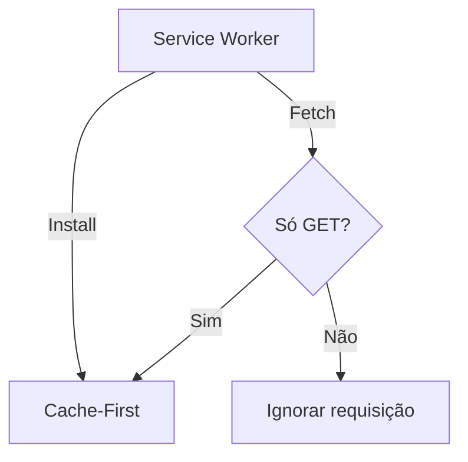
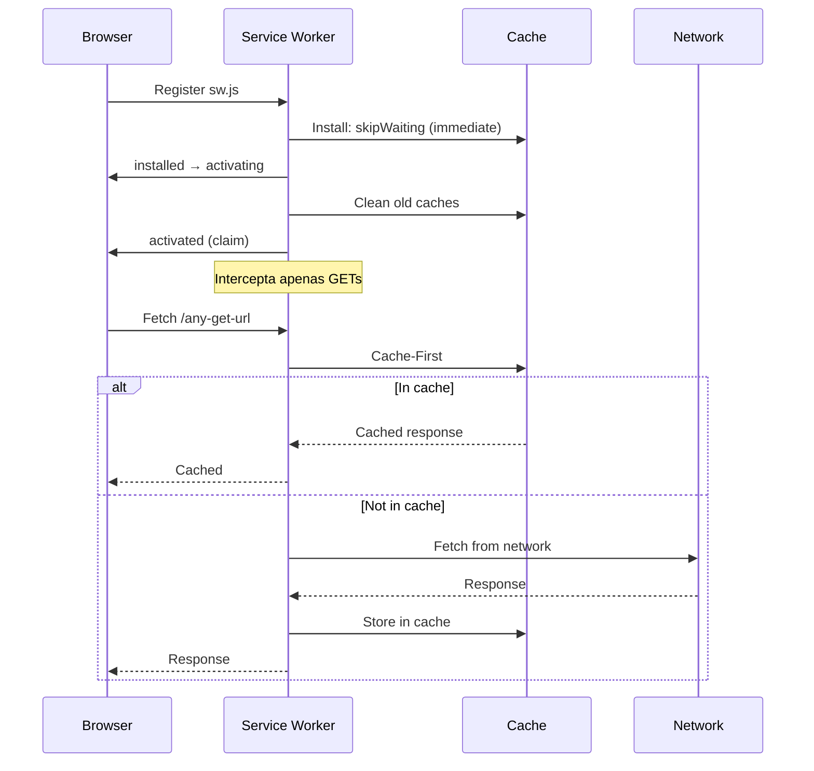

# Service Worker Notes

> Documentação da arquitetura PWA do Gestor Financeiro.  
> Arquivo: `front-end/public/sw.js` (v3 — refatorado com Vite)

---

## Visão Geral



---

## Cache Strategy

### STATIC_CACHE (Cache-First)

O SW atual só intercepta requisições **GET** e aplica cache-first genérico (assets + API calls).

```javascript
const CACHE_NAME = 'static-v3';
```

| Evento | Ação |
|--------|------|
| `install` | Ativa imediatamente (`skipWaiting`) |
| `activate` | Limpa caches antigos + toma controle (`claim`) |
| `fetch` | Cache-first para GETs; ignora DELETE/PUT/POST |

> [!warning] Estado atual (05/2026)
> - ❌ Sem push notifications
> - ❌ Sem sync event / fila offline
> - ❌ Sem DATA_CACHE separada
> - ❌ Sem stale cache para API
> - ❌ Sem banner offline no frontend
> - Apenas cache-first genérico para GET requests

---

## Service Worker Lifecycle



---

## Modo Offline

> [!warning] Não implementado atualmente
> O SW apenas cacheia requisições GET. Não há:
> - Fila offline para transações pendentes
> - Banner offline no frontend
> - Sincronização ao reconectar

### Comportamento Atual

| Operação | Comportamento Offline |
|----------|----------------------|
| GET (assets + API) | Servido do cache (dados podem estar desatualizados) |
| POST/PUT/DELETE | Falha silenciosamente (não passa pelo SW) |
| Login/Registro | Bloqueado (requer rede) |

---

## Performance

| Métrica | Valor | Nota |
|---------|:-----:|------|
| Tamanho do sw.js | ~0.5KB | Apenas cache-first GET |
| Static Cache | Variável | Cresce com uso |
| Estratégia API | Cache-first | Dados podem ficar desatualizados |
| Instalação PWA | ~1s (3G) | Mínimo necessário |

---

## Checklist PWA

- [x] `manifest.json` com nome, ícones e theme_color
- [x] Service Worker registrado e ativo
- [x] Cache de assets (cache-first para GETs)
- [x] Ícone 192×192 e 512×512
- [x] Meta tags `mobile-web-app-capable`
- [x] Estratégia de atualização (skipWaiting + claim)
- [ ] Push notifications (não implementado)
- [ ] Fallback offline com banner (não implementado)
- [ ] Fila offline para transações pendentes (não implementado)
- [ ] Sincronização automática ao reconectar (não implementado)

%%==================================================================================%%

## Notas Relacionadas

- [[Gestor Financeiro]]
- [[API Documentation]]
- [[Readme do Projeto]]
- [[Ideias de Melhorias]]
