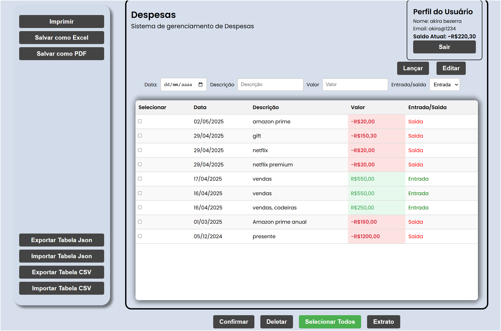
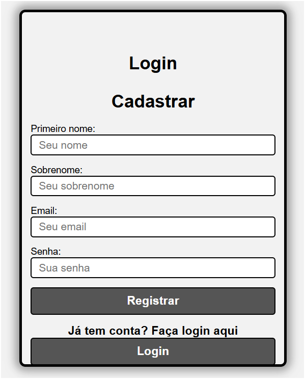
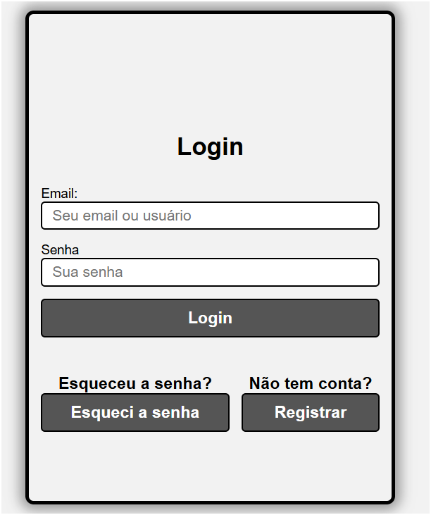
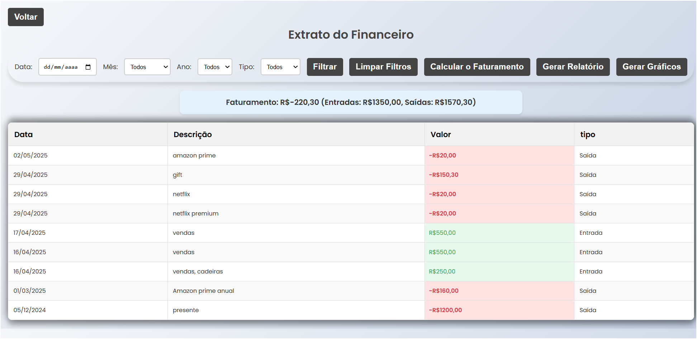
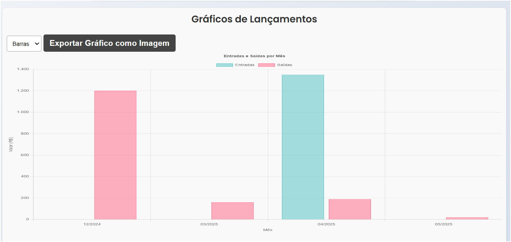

# Financeiro Pessoal

Um projeto visualizado para pessaos que querem manejar o seu dinheiro na vida pessoal ou para o trabalho, é mais ligado para aqueles que gostam do visual. 
  


## Funcionalidades

- Cadastro 
- Gerar gráficos 
- Savlar em PDF, EXCEL e imprimir 
- Multiplataforma
- Exportar e importar em JSON e CSV
- Um extrato só com seus gastos e ganhos com filtros 


## Screenshots







## Demonstração
https://projeto-financeiro-frontend.vercel.app/login/login.html
## Variáveis de Ambiente

Para rodar esse projeto, você vai precisar adicionar as seguintes variáveis de ambiente no seu .env

`DATABASE_URL  = 'URL DO POSTGRESQL'`
`NODE_ENV = DEVELOPMENT `
`JWT_SECRET`
`PORT = 3000`


## Rodando localmente

Clone o projeto

```bash
  git clone https://github.com/Henrique1601/Projeto-Financeiro.git
```

Entre no diretório do projeto

```bash
  cd backend
```

Instale as dependências

```bash
  npm install
```

Inicie o servidor

```bash
  npm run start 
```
ou
```bash
  npm run dev(nodemon)
```


## Stack utilizada

**Front-end:** HTML, CSS, JavaScript

**Back-end:** Node, Express

**Banco de dados** PostgreSQL, Neon e Sqlite

## Autores

- [@HenriqueBezerra](https://github.com/Henrique1601)


## Licença

[MIT](LICENSE)

