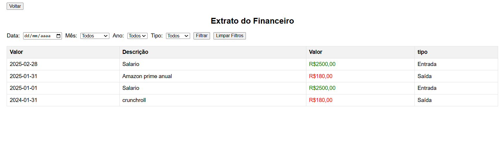
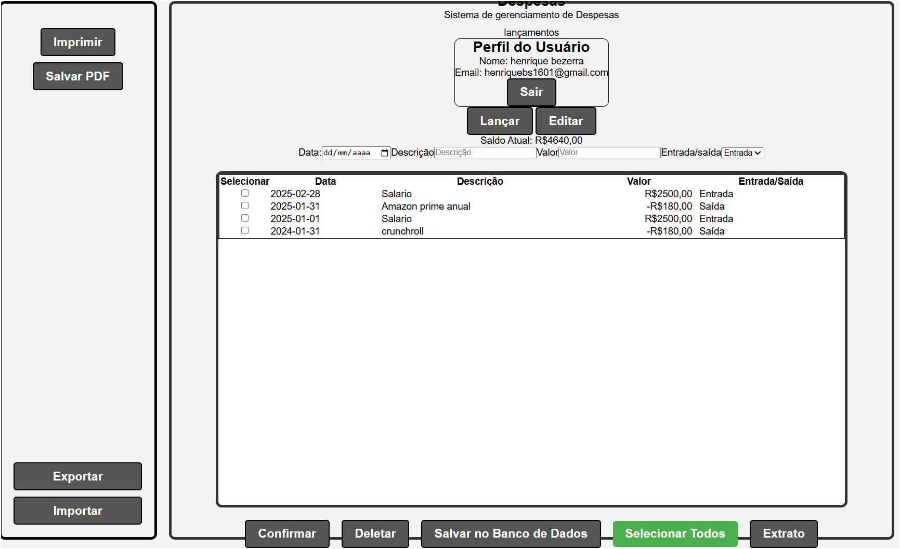

#Projeto financeiro pessoal para detalhar e controlar suas financias 
Em andamento ainda...

## Prints do projeto
!

##

## Tecnologias usadas
  
   
   
  <a href="https://developer.mozilla.org/en-US/docs/Web/JavaScript" target="_blank" rel="noreferrer">   
 <a href="https://nodejs.org" target="_blank" rel="noreferrer">

